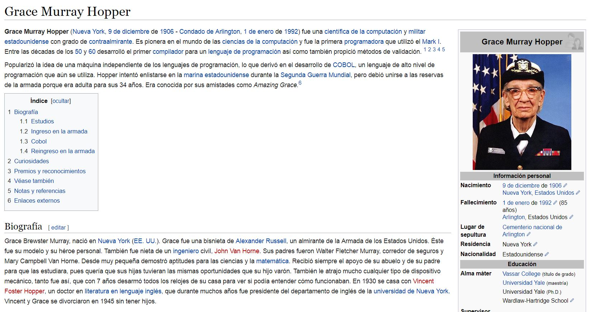

Posicionamiento de cajas
=============
Índice
------
* [Descripción general](#cabecera1)
* [Contenido](#cabecera2)
* [Autora](#cabecera3)
* [Fecha](#cabecera4)

#### Se puede acceder a la previsualización de este proyecto
[en línea](https://lizbethfp.github.io/grace-hopper/)

Descripción general
-------------------
Réplica de la siguiente imagen poniendo en práctica los conocimientos de *HTML* y *CSS*:

Contenido
---------
Este proyecto se encuentra constituido por las siguientes carpetas:

##### Assets
Carpeta que contiene otra carpeta llamada "images", en la que se encuentra dos imágenes en formato JPG para la muestra de la biografía a replicar de Grace Hopper y una foto suya.

##### CSS
Carpeta que contiene la hoja de estilos para darle formato al HTML.

##### INDEX HTML
Página principal que aloja a la biografía de Grace Hopper.

##### INFORMATION HTML
Página secundaria que aloja mayor información de Grace Hopper.

#### README
Documento explicativo del proyecto.

Autora
------
Lizbeth Félix Peña

Fecha
-----
21/10/2017
